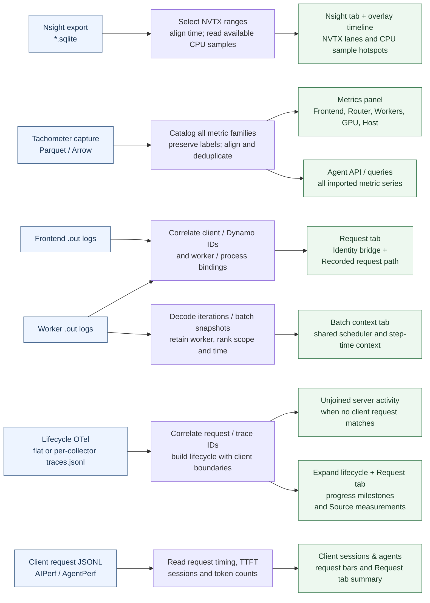
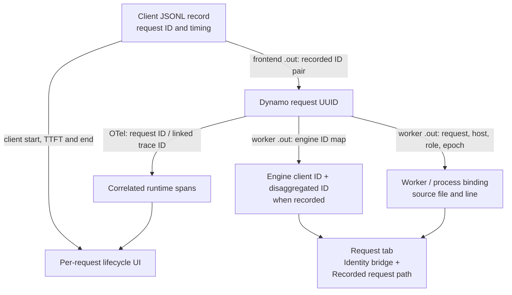

# DSight data flow: from captured files to UI

Use this page to answer: **Which file supplies this part of the dashboard, and
what happens to its data along the way?** See [DSight](dsight.md) for build
commands, input discovery and detailed timing definitions.

## Source files to visible views

The arrows below describe the current implementation. Blue boxes are saved
inputs; green boxes name their destinations in the UI. Each path shows what a
source contributes. The request-identity dependencies are expanded in the next
diagram.

The Python readers produce one normalized dataset containing requests, sessions,
workers, metrics, profiles, batch observations and unjoined server activity,
with references back to source files
and rows. The builder writes `trace-data.json.gz` and embeds the same data in
`index.html`, with metric samples split into independently compressed families.
The browser reads the catalog immediately and decompresses metric points when
selected or queried. It does not open the original SQLite, Parquet or log files.

All views share a time origin: the first selected client request, or the earliest
recorded source timestamp when no client export is available. Nsight uses its
recorded UTC anchor; metric samples use their recorded epoch timestamps. Worker
logs need `--iteration-timezone` to align timestamps without an offset; their
recorded precision is retained. No cross-host clock correction is inferred.

The UI destinations use the current section and tab names:

| Visible area | What its data means |
| --- | --- |
| **Nsight** tab and overlay | NVTX intervals arranged by thread and overlap lane, alongside the selected request. Available frontend CPU samples feed **Frontend CPU sample hotspots**. CUDA kernel timing is not imported. |
| **Metrics** panel | A searchable selector groups every captured family into Frontend, Router, Workers, GPU and Host categories. Each family uses one shared chart across workers, hosts, ranks and labels; its legend controls individual series. Pinned families remain stacked while browsing other metrics, and all charts follow the shared time range. Families without samples in the selected capture window remain discoverable. |
| **Agent API / queries** | All imported metric series and bounded queries for independent server activity, batch observations and profiles. |
| **Batch context** tab | Recorded iteration or scheduler-snapshot fields. Missing counters and timers stay unknown; these are not per-request stage durations. |
| **Request** tab | Client measurements, recorded ID mappings, worker path and correlated OTel source measurements. **Expand lifecycle** shows chronological progress milestones. Source measurements retain the original durations of overlapping spans. |

The Nsight overlay is a time-based NVTX timeline. Its CPU hotspot table is a
separate view of samples, not an aggregate CPU flamegraph.

## Following one request across sources

The client export establishes the request and its timing. Frontend logs bridge
its HTTP request ID to the Dynamo UUID using text or JSON records. That UUID
connects to OTel spans and, independently, to worker/process bindings and any
engine-local IDs recorded in worker logs.

- **OTel supplies the existing request breakdown.** Supported spans retain their
  timestamps, parents and inclusive durations. Client start/first-token/end
  boundaries and server milestones produce the progress rows. An engine ID map
  is not required to construct these rows.
- **Worker bindings supply ownership and navigation.** Common Dynamo log fields
  associate a request with a recorded host, role and process epoch. The host and
  role must match the worker filename. Bindings retain the Dynamo attempt and
  their source/line, independently of engine-local IDs.
- **Engine ID maps supply additional identity.** TRT-LLM logs associate the
  Dynamo UUID with an engine client ID and disaggregated ID. These remain in
  `engine` and also supply a worker binding. Process scope comes from correlated
  spans when unambiguous; an unknown process remains unknown.
- **Span-to-worker association is explicit about its basis.** OTel joins to a
  matching request/process binding, or to the only discovered worker matching
  its recorded host and role. Collector directory names are not host evidence.
  Conflicting bindings remain in **Identity bridge** and **Evidence** but are
  omitted from the confirmed request path and worker filters.
- **Timing overlap supplies shared context.** A matching worker and overlapping
  Nsight range or iteration can be inspected beside a request. That overlap does
  not assign the batch's execution cost to the request.

An ID pair alone contains no queue, compute or KV-transfer duration. The current
engine log decoders supply ID maps, iteration summaries and batch snapshots; they do not add
an engine-specific per-request breakdown beyond OTel.

## What the shared engine interface contributes

The engine interface centralizes vocabulary while the readers keep I/O, clocks,
correlation, source references and limits.

| Input to the engine interface | Answer returned to the reader |
| --- | --- |
| One worker-log line | Typed engine identity, iteration or scheduler-snapshot observations, or no recognized record. |
| An NVTX name and duration | Whether to include that host annotation and its engine/scope metadata. Original names and timestamps remain in the profile records. |
| A recorded metric name | Optional engine-specific display metadata and units. The shared Tachometer catalog includes other captured families too; values, labels and source rows remain in the metric reader. |

TRT-LLM currently supplies all three kinds of rules. SGLang supplies NVTX prefixes
and metric definitions; it has no worker-log decoder here. TokenSpeed supplies
NVTX vocabulary, metric definitions and periodic batch snapshots. A dialect can
omit sources it cannot interpret.

## Missing inputs

| Missing input | Current behavior |
| --- | --- |
| Client request export | Other sources can establish the time window. Client request bars and per-request breakdowns are absent; shared evidence remains available. |
| Frontend ID bridge | Requests retain client timing; correlation to Dynamo/engine IDs is unavailable. |
| Supported, correlated OTel | The affected request has no lifecycle expansion, milestone rows or source-measurement breakdown. Its client bar and TTFT remain. |
| Worker logs / engine ID maps | Log-based bindings, engine identities and iteration context are absent. OTel can still identify a unique discovered worker by its recorded host/role. |
| Nsight export or usable profile data | The Nsight section and controls are hidden. Missing CPU samples separately hide the hotspot table. |
| Tachometer capture | Metric charts and selectors are hidden. |
| Batch observations | The Batch context tab is hidden. |

Every source is optional. A build still needs a positive recorded time range.
Explicitly selected missing paths, malformed records and nonempty client exports
with no matching phase remain errors. An empty time selection keeps controls for
available sources; restored views cannot enable controls for missing evidence.
