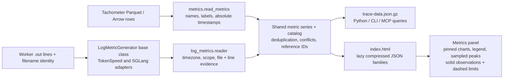

# DSight metric sources and log generators

The **Metrics** panel reads one normalized series/catalog schema. Its inputs are
Tachometer Parquet/Arrow captures and supported worker logs. Both go through the
same series finalization, source evidence, compressed family loading, charts,
pinning and query APIs. No AIPerf metric summary is used for these families.

## Source to UI



The browser does not parse Parquet. Log-derived metrics enter the shared
normalized schema directly; no intermediate Parquet conversion is required.

## Tachometer capture schema

| Field | Type | Meaning |
| --- | --- | --- |
| `timestamp_ns` | int64 | Absolute UTC epoch nanoseconds; required for alignment |
| `metric_name` | string | Metric name with optional inline labels |
| `metric_value` | float64 | Captured scalar or histogram bucket value |
| `scraper_endpoint` | string | Source endpoint identity |
| `time_since_start` | float64 | Tachometer-relative time; DSight aligns on `timestamp_ns` |
| `histogram_bucket_lower`, `histogram_bucket_upper`, `histogram_sum`, `histogram_count` | nullable float64 | Histogram capture fields |
| Additional metadata columns | strings | Host, worker, GPU and other source identity dimensions |
| `metric_name_clean` | string, when present | Compaction-derived name; not required by DSight |

The first four columns are required by the DSight metric reader. Histogram
bounds contribute to series identity; sum/count columns do not create additional
series. `final.parquet` supersedes compacted shards, while an Arrow tail can still
be read. The reader detects Parquet versus Arrow from contents, including captures
whose file suffix does not match their encoding.

## Normalized series

Each series carries `id`, `name`, `label`, `unit`, catalog presentation metadata,
`worker`, `host`, `gpu`, `rank`, `rank_kind`, `worker_process`, `labels`,
`source_ids`, and `points`. A point is:

```text
[elapsed_seconds_from_run_origin, value, source_id, source_row_or_line]
```

`source_id` indexes the dataset's source manifest. Tachometer rows are zero-based;
worker log lines are one-based. The manifest retains the file identity and hash.
Log series additionally declare `source_kind: "worker_log"`, `generator`,
`time_resolution_s`, and `temporal`:

- `sample`: a recorded observation; no value is assumed before or after it.
- `event`: a recorded per-request observation; distinct source lines remain
  distinct points even when timestamp and value match. Simultaneous events do
  not count as conflicting metric samples.
- `setting`: a recorded configuration held until the next setting in the same
  scope. A null value invalidates the previous setting. The last timestamp group
  before the trace window is retained at its original, possibly negative, elapsed
  timestamp. Queries expose preceding-window evidence as `carried_setting`,
  separately from in-range `points` and sample statistics.

An observed series can declare a `reference` with `name`, `label` and `series_id`.
The reference is another ordinary metric series in the same unit, independently
selectable and queryable. A missing match has `series_id: null`.

Reference matching requires the same source file, worker, rank namespace/rank,
recorded process and labels. It never pools ranks, borrows another worker's
configuration, or equates attention TP rank with GPU/global/DP rank. When a log
has no process identity, that field remains null; file and rank still isolate it.
Conflicting values at one timestamp remain in raw evidence and appear as gaps.

## Dynamo–TokenSpeed metrics

| Metric name to select or pin | Source field | Unit | Paired reference |
| --- | --- | --- | --- |
| `log_tokenspeed_active_decode_requests` | Decode batch `#running-req` | requests | `log_tokenspeed_decode_request_limit` |
| `log_tokenspeed_decode_request_limit` | Scheduler config `max_batch_size` | requests | — |
| `log_tokenspeed_active_kv_pages` | `#pages(active/cached/total)` → active | pages | `log_tokenspeed_kv_pool_pages` |
| `log_tokenspeed_kv_pool_pages` | `#pages(active/cached/total)` → total | pages | — |

These families appear under **Workers / Log-derived metrics**. Generated metrics
use `log_<component>_<name>`, where `<component>` identifies the component that
produced the consumed log. The `log_` prefix distinguishes generated evidence from
native Prometheus metrics. These logs come from TokenSpeed, so their component is
`tokenspeed`, even when TokenSpeed runs through the Dynamo integration.
Active decode batch is not the exported `tokenspeed:num_requests_running`
scheduler-state count. The configured per-scheduler batch limit is not global
`max_num_seqs` or benchmark concurrency. KV pool size comes from the same snapshot
as active pages, not `num_device_pages`, reserved-page arithmetic, or token counts.

The adapter reuses the existing TokenSpeed batch decoder and recognizes scheduler
configuration lines. It preserves attention TP rank. Local timestamps need an
explicit `--iteration-timezone`; otherwise these metrics are omitted with a
warning. Missing page fields or configuration do not create zero-valued samples.
A new scheduler configuration without a valid positive `max_batch_size` clears
the previous limit. Settings are not applied before their recorded timestamps.

## SGLang batch metrics

SGLang `Prefill batch` and `Decode batch` lines, with or without a `[counter]`,
contribute the recorded fields below as `log_sglang_*` observations. The shared
reader retains each physical log line as evidence. Each series keeps the DP rank
when logged, plus any `pp`, `attn_cp`, `moe_dp`, `tp`, and `ep` labels and a
`phase` label (`prefill` or `decode`); values from different ranks,
phases, files or workers are never summed. A field absent or invalid on a line
creates no point. All values are snapshots or logger-reported rates, not held
settings or continuously measured occupancy.

| Phase | Recorded fields | Metric suffixes | Units |
| --- | --- | --- | --- |
| Prefill | `#new-seq`, `#new-token`, `#cached-token` | `new_sequences`, `new_tokens`, `cached_tokens` | requests, tokens, tokens |
| Prefill | `#pending-token`, `#bootstrap-req`, `#inflight-req`, `#optimistic-req` | `pending_tokens`, `bootstrap_requests`, `inflight_requests`, `optimistic_requests` | tokens, requests, requests, requests |
| Prefill | `input throughput (token/s)` | `input_throughput_tokens_per_second` | tokens/s |
| Decode | `#token`, `#prealloc-req`, `#transfer-req`, `#retracted-req` | `decode_tokens`, `preallocated_requests`, `transfer_requests`, `retracted_requests` | tokens, requests, requests, requests |
| Decode | `accept len`, `accept rate`, `pre-allocated usage`, `gen throughput (token/s)` | `accept_length`, `accept_rate`, `preallocated_usage`, `generation_throughput_tokens_per_second` | tokens, ratio, ratio, tokens/s |
| Both | `#running-req`, `#queue-req`, `token usage`, `cuda graph` | `running_requests`, `queued_requests`, `token_usage`, `cuda_graph_enabled` | requests, requests, ratio, boolean (0/1) |

The suffixes in this table have the `log_sglang_` prefix in the catalog. `#token`
is the decode pool's used-token count excluding available and evictable tokens.
SGLang logs `#cached-token` as batch
`log_hit_tokens`; it is not a full-workload cache hit rate. `token usage` is the
reported token-pool ratio, and `pre-allocated usage` is the preallocated-token
count divided by the scheduler token capacity. `accept len` and `accept rate`
are the speculative acceptance values reported for that decode logging interval.
Input and generation throughput are the logger's own rates over its preceding
logging interval. The adapter does not derive a cache-hit fraction, resample a
rate, or infer values between samples.

SGLang timestamps are local. Pass the run's actual timezone through
`--iteration-timezone` to align them with client and exported telemetry; without
it the reader omits these metrics and records a warning.
Both default second-resolution timestamps and optional fractional seconds are
supported. `SGLANG_LOG_MS` and `SGLANG_LOG_FORWARD_ITERS` are not required.
Rank prefixes may contain any of `DP`, `PP`, `ATTN_CP`, `MOE_DP`, `TP`, and `EP`,
or no ranks. Without a logged `DP`, the normalized rank and rank kind remain
unknown; a `TP` label is not reinterpreted as a DP rank. A series records the
coarsest timestamp precision among its observations (1 s without a fraction).
These formats follow the pinned upstream [logger](https://github.com/sgl-project/sglang/blob/f884231f5a3108d9139b0141406ddea60f6a97ff/python/sglang/srt/utils/common.py#L2453),
[rank prefix](https://github.com/sgl-project/sglang/blob/f884231f5a3108d9139b0141406ddea60f6a97ff/python/sglang/srt/managers/scheduler.py#L5991),
and [batch formatter](https://github.com/sgl-project/sglang/blob/f884231f5a3108d9139b0141406ddea60f6a97ff/python/sglang/srt/managers/scheduler_components/metrics_reporter.py#L702).

Batch observations use `event` semantics because multiple batches can share
one logged second. Queries retain every line, including repeated values; the
chart shows a labeled median and event count for coincident observations.
It does not fabricate ordering or subsecond timestamps. The
[synthetic SGLang example](../examples/dsight/sglang/README.md) includes both default
and detailed formats and builds a report from these logs alone.

### Per-request timing records

SGLang `ReqTimeStats(...)` lines also enter the same catalog. The request's
`rid` stays in the source line, not in series labels. A request emits one
record when the scheduler sees it finished and request-time logging is enabled;
the point is placed at the **log emission time**, which is an observation after
completion, not the queue-entry or first-forward time. Scope retains the logged
rank labels when present and `type=prefill` or `type=decode` as the `phase` label.

| Metric suffix after `log_sglang_` | Source or calculation | Unit |
| --- | --- | --- |
| `request_input_tokens`, `request_cached_input_tokens` | `input_len`, `cached_input_len` on that request | tokens |
| `request_uncached_input_tokens` | `input_len - cached_input_len`, when both counts are valid and cached ≤ input | tokens |
| `request_cached_input_fraction` | `cached_input_len / input_len`, when input > 0 and 0 ≤ cached ≤ input | ratio |
| `request_bootstrap_duration_ms`, `request_queue_duration_ms`, `request_forward_duration_ms` | Corresponding `ReqTimeStats` durations on either phase | ms |
| `request_allocation_wait_duration_ms`, `request_transfer_duration_ms` | Decode-only `alloc_wait_duration`, `transfer_duration` | ms |
| `request_bootstrap_queue_duration_ms` | Prefill `bootstrap_queue_duration` when bootstrap has not completed | ms |
| `request_preallocation_queue_duration_ms` | Decode `prealloc_queue_duration` when no bootstrap-completion timestamp is available | ms |
| `request_transfer_speed_gib_per_second`, `request_transfer_total_mib` | Prefill-only transfer fields as logged | GiB/s, MiB |

These durations describe the individual request's recorded stages. They cannot
be summed across requests, equated with client latency, or assigned to the
emission timestamp as if that were their start. `request_cached_input_fraction`
is a per-request fraction, not the batch's `#cached-token` share or a
full-workload cache hit rate. A missing or invalid input count leaves that
derived value absent; a valid zero denominator remains unknown rather than zero.
Request metrics use `event` semantics: queries and SQLite keep every request's
point and source line, including repeated values at the same logged timestamp. The
chart displays the median when events share a timestamp and labels the number
of events at that tick. This display value is not an additional raw sample;
hover and the source query distinguish it from individual requests. The line
between event ticks is a visual guide, not continuous occupancy.
SGLang computes `transfer_total` by dividing bytes by 1024² and `transfer_speed`
by 1024³, despite printing `MB` and `GB/s`; the catalog uses their binary units.
For chunked prefill transfer, the logged transfer timing can cover only the last
chunk, so these fields do not establish a whole-request transfer rate.
Its duration formatter returns zero when either timing endpoint is unavailable,
so a logged zero does not always prove a zero-length stage. Prefill
`forward_duration` runs from forward entry through completion and can include
chunking and transfer. The logged prefill `entry_time` is the bootstrap queue
entry time, while `queue_duration` starts at the waiting queue entry; the
adapter does not use `entry_time` as an alignment anchor.
Alternative queue durations retain their own metric names; they do not create
`request_bootstrap_duration_ms` or `request_allocation_wait_duration_ms` points.
When prefill instead logs `bootstrap_done_time`, that wall-clock timestamp stays
in the source evidence and is not converted into a duration. Other valid fields
on the same request still contribute points.
The [upstream request-timing implementation](https://github.com/sgl-project/sglang/blob/f884231f5a3108d9139b0141406ddea60f6a97ff/python/sglang/srt/observability/req_time_stats.py)
defines the stage boundaries, missing-endpoint behavior, and binary transfer units.

## Capacity presentation

Pin **Active decode batch** and **Active KV pages** to see activity and capacity
on the same time axis. Each source has a solid observed line and a matching
**dashed** limit in the same units. Hiding that source hides both lines. Capacity
charts start at zero and include the reference in the vertical scale.

The legend highlights **Peak observed** and the limit/pool value using exact
counts. **Highest observed usage** is the maximum of each sample divided by its
corresponding valid positive limit. It is not the ratio of unrelated maxima,
a time-weighted average, or proof of continuous saturation. Zooming recomputes
these summaries for the selected time range, separately for each source.

A configuration reference becomes a dashed step, including when its establishing
log precedes the selected window. Only display coordinates are extended to view
boundaries; source samples and their timestamps are unchanged. A sampled pool
reference is bounded by its samples; usage requires a matching sample timestamp.
Changed limits display a range marked **changed**. Missing/ambiguous limits show
**unavailable**, including the count of observed samples without a valid limit.
The observed metric still works without a reference, Tachometer, OTel or Nsight.

## Generator interface

`log_metrics/base.py` defines frozen `LogMetricDefinition` and `LogMetricEvent`
records and the `LogMetricGenerator` abstract base class:

```python
from abc import ABC, abstractmethod

class LogMetricGenerator(ABC):
    @property
    @abstractmethod
    def name(self) -> str: ...

    @property
    @abstractmethod
    def definitions(self) -> tuple[LogMetricDefinition, ...]: ...

    @abstractmethod
    def parse_line(self, line: str, source: SourceIdentity) -> LogMetricEvent | None: ...
```

A generator returns timestamped values and recorded rank/process/label scope;
unsupported lines return `None`. Definitions supply metric names, units, sample
versus event/setting semantics and optional reference relationships. The shared reader
owns file discovery, timezone alignment, window selection, evidence, validation,
normalization and reference matching. Configuration-only evidence does not invent
a workload time envelope for a source-only report.

`log_metrics/__init__.py` holds the generator registry. Implementations inherit
`LogMetricGenerator` and provide all three abstract members; class attributes can
supply `name` and `definitions`. Add each implementation to the registry with
representative source fixtures and missing/changed-limit tests. Engine
log syntax stays in the adapter; rendering depends only on the normalized contract.
`DynamoTokenSpeedLogMetrics` and `SGLangLogMetrics` are registered generators.

Focused checks:

```bash
uv run pytest tests/test_dsight_log_metrics.py
uv run pytest tests/test_dsight_sglang_log_metrics.py
uv run --with websockets python tests/dsight_log_metrics_check.py --port 9222 --out /tmp/dsight-log-metrics-check
```

The browser check requires a Chrome instance with remote debugging enabled. It
builds synthetic source fixtures and checks paired visibility, zoomed summaries,
changing/missing/conflicting limits, source evidence and narrow-screen layout.
