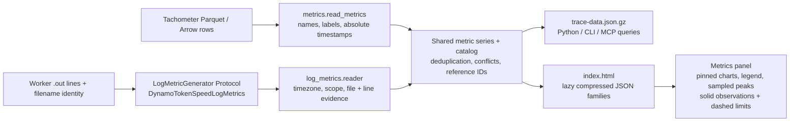

# DSight metric sources and log generators

The **Metrics** panel reads one normalized series/catalog schema. Its inputs are
Tachometer Parquet/Arrow captures and supported worker logs. Both go through the
same series finalization, source evidence, compressed family loading, charts,
pinning and query APIs. No AIPerf metric summary is used for these families.

## Source to UI



The browser does not parse Parquet. Log-derived metrics enter the shared
normalized schema directly; no intermediate Parquet conversion is required.

## Tachometer capture schema

| Field | Type | Meaning |
| --- | --- | --- |
| `timestamp_ns` | int64 | Absolute UTC epoch nanoseconds; required for alignment |
| `metric_name` | string | Metric name with optional inline labels |
| `metric_value` | float64 | Captured scalar or histogram bucket value |
| `scraper_endpoint` | string | Source endpoint identity |
| `time_since_start` | float64 | Tachometer-relative time; DSight aligns on `timestamp_ns` |
| `histogram_bucket_lower`, `histogram_bucket_upper`, `histogram_sum`, `histogram_count` | nullable float64 | Histogram capture fields |
| Additional metadata columns | strings | Host, worker, GPU and other source identity dimensions |
| `metric_name_clean` | string, when present | Compaction-derived name; not required by DSight |

The first four columns are required by the DSight metric reader. Histogram
bounds contribute to series identity; sum/count columns do not create additional
series. `final.parquet` supersedes compacted shards, while an Arrow tail can still
be read. The reader detects Parquet versus Arrow from contents, including captures
whose file suffix does not match their encoding.

## Normalized series

Each series carries `id`, `name`, `label`, `unit`, catalog presentation metadata,
`worker`, `host`, `gpu`, `rank`, `rank_kind`, `worker_process`, `labels`,
`source_ids`, and `points`. A point is:

```text
[elapsed_seconds_from_run_origin, value, source_id, source_row_or_line]
```

`source_id` indexes the dataset's source manifest. Tachometer rows are zero-based;
worker log lines are one-based. The manifest retains the file identity and hash.
Log series additionally declare `source_kind: "worker_log"`, `generator`,
`time_resolution_s`, and `temporal`:

- `sample`: a recorded observation; no value is assumed before or after it.
- `setting`: a recorded configuration held until the next setting in the same
  scope. A null value invalidates the previous setting. The last timestamp group
  before the trace window is retained at its original, possibly negative, elapsed
  timestamp. Queries expose preceding-window evidence as `carried_setting`,
  separately from in-range `points` and sample statistics.

An observed series can declare a `reference` with `name`, `label` and `series_id`.
The reference is another ordinary metric series in the same unit, independently
selectable and queryable. A missing match has `series_id: null`.

Reference matching requires the same source file, worker, rank namespace/rank,
recorded process and labels. It never pools ranks, borrows another worker's
configuration, or equates attention TP rank with GPU/global/DP rank. When a log
has no process identity, that field remains null; file and rank still isolate it.
Conflicting values at one timestamp remain in raw evidence and appear as gaps.

## Dynamo–TokenSpeed metrics

| Metric name to select or pin | Source field | Unit | Paired reference |
| --- | --- | --- | --- |
| `log_tokenspeed_active_decode_requests` | Decode batch `#running-req` | requests | `log_tokenspeed_decode_request_limit` |
| `log_tokenspeed_decode_request_limit` | Scheduler config `max_batch_size` | requests | — |
| `log_tokenspeed_active_kv_pages` | `#pages(active/cached/total)` → active | pages | `log_tokenspeed_kv_pool_pages` |
| `log_tokenspeed_kv_pool_pages` | `#pages(active/cached/total)` → total | pages | — |

These families appear under **Workers / Log-derived metrics**. Generated metrics
use `log_<component>_<name>`, where `<component>` identifies the component that
produced the consumed log. The `log_` prefix distinguishes generated evidence from
native Prometheus metrics. These logs come from TokenSpeed, so their component is
`tokenspeed`, even when TokenSpeed runs through the Dynamo integration.
Active decode batch is not the exported `tokenspeed:num_requests_running`
scheduler-state count. The configured per-scheduler batch limit is not global
`max_num_seqs` or benchmark concurrency. KV pool size comes from the same snapshot
as active pages, not `num_device_pages`, reserved-page arithmetic, or token counts.

The adapter reuses the existing TokenSpeed batch decoder and recognizes scheduler
configuration lines. It preserves attention TP rank. Local timestamps need an
explicit `--iteration-timezone`; otherwise these metrics are omitted with a
warning. Missing page fields or configuration do not create zero-valued samples.
A new scheduler configuration without a valid positive `max_batch_size` clears
the previous limit. Settings are not applied before their recorded timestamps.

## Capacity presentation

Pin **Active decode batch** and **Active KV pages** to see activity and capacity
on the same time axis. Each source has a solid observed line and a matching
**dashed** limit in the same units. Hiding that source hides both lines. Capacity
charts start at zero and include the reference in the vertical scale.

The legend highlights **Peak observed** and the limit/pool value using exact
counts. **Highest observed usage** is the maximum of each sample divided by its
corresponding valid positive limit. It is not the ratio of unrelated maxima,
a time-weighted average, or proof of continuous saturation. Zooming recomputes
these summaries for the selected time range, separately for each source.

A configuration reference becomes a dashed step, including when its establishing
log precedes the selected window. Only display coordinates are extended to view
boundaries; source samples and their timestamps are unchanged. A sampled pool
reference is bounded by its samples; usage requires a matching sample timestamp.
Changed limits display a range marked **changed**. Missing/ambiguous limits show
**unavailable**, including the count of observed samples without a valid limit.
The observed metric still works without a reference, Tachometer, OTel or Nsight.

## Generator interface

`log_metrics/base.py` defines frozen `LogMetricDefinition` and `LogMetricEvent`
records and the `LogMetricGenerator` Protocol:

```python
class LogMetricGenerator(Protocol):
    @property
    def name(self) -> str: ...

    @property
    def definitions(self) -> tuple[LogMetricDefinition, ...]: ...

    def parse_line(self, line: str, source: SourceIdentity) -> LogMetricEvent | None: ...
```

A generator returns timestamped values and recorded rank/process/label scope;
unsupported lines return `None`. Definitions supply metric names, units, sample
versus setting semantics and optional reference relationships. The shared reader
owns file discovery, timezone alignment, window selection, evidence, validation,
normalization and reference matching. Configuration-only evidence does not invent
a workload time envelope for a source-only report.

`log_metrics/__init__.py` holds the generator registry. An implementation is added
there with representative source fixtures and missing/changed-limit tests. Engine
log syntax stays in the adapter; rendering depends only on the normalized contract.
`DynamoTokenSpeedLogMetrics` is the implemented generator.

Focused checks:

```bash
uv run pytest tests/test_dsight_log_metrics.py
uv run --with websockets python tests/dsight_log_metrics_check.py --port 9222 --out /tmp/dsight-log-metrics-check
```

The browser check requires a Chrome instance with remote debugging enabled. It
builds synthetic source fixtures and checks paired visibility, zoomed summaries,
changing/missing/conflicting limits, source evidence and narrow-screen layout.
