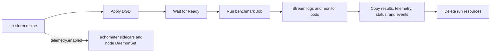

# Dynamo Kubernetes deployments

srtctl can render, deploy, monitor, benchmark, collect, and delete Dynamo `DynamoGraphDeployment` (DGD) resources from the same recipe format used for SLURM. Kubernetes support is implemented directly in srtctl.

## Scope

The Kubernetes path owns the finite deployment and benchmark lifecycle:



It does not create a namespace, install the Dynamo operator, create secrets or PVCs, deploy an OTEL collector, provide multi-user scheduling, build runtime images, or manage object storage.

## Prerequisites

- A Kubernetes cluster with NVIDIA GPUs and the Dynamo operator installed with the `nvidia.com/v1beta1` DGD CRD.
- `kubectl` configured for the target cluster when using `apply` or `delete`.
- `model.container` set to an OCI image that already contains Dynamo and the selected backend. SLURM `.sqsh` paths and the `dynamo.install` build flow are not used in Kubernetes.
- A semantic Dynamo version in the image tag, such as `:1.4.0`, or an explicit `kubernetes.runtime_version`.
- Existing secrets, ConfigMaps, volumes, and PVCs referenced by the recipe.
- A benchmark image with the benchmark's runtime dependencies. srtctl mounts its packaged benchmark scripts into the Job; `benchmark.container_image` can override the model image.
- `tar` in the benchmark and Tachometer images when local artifact collection through `kubectl cp` is required.

## Commands

```bash
# Print all generated resources.
srtctl k8s generate -f recipe.yaml

# Write them to a file.
srtctl k8s generate -f recipe.yaml -o deployment.yaml

# Apply all resources and wait for the DGD Ready condition.
srtctl k8s apply -f recipe.yaml

# Apply without waiting, or override the readiness timeout.
srtctl k8s apply -f recipe.yaml --no-wait
srtctl k8s apply -f recipe.yaml --timeout 1200

# Deploy, run benchmark.type, stream its logs, collect output, then clean up.
srtctl k8s run -f recipe.yaml
srtctl k8s run -f recipe.yaml --output-dir outputs/k8s-run
srtctl k8s run -f recipe.yaml --timeout 1200 --benchmark-timeout 7200

# Inspect a running or retained deployment from another terminal.
srtctl k8s status -f recipe.yaml
srtctl k8s logs -f recipe.yaml --follow
srtctl k8s logs -f recipe.yaml --component frontend --tail 500

# Retain resources after a run for inspection, then delete everything later.
srtctl k8s run -f recipe.yaml --keep-resources
srtctl k8s delete -f recipe.yaml
```

`k8s run` rejects `benchmark.type: manual` because a manual benchmark has no finite completion point. Use `k8s apply`, `k8s status`, and `k8s logs --follow` for an interactive deployment.

Override recipes use the existing selector syntax:

```bash
srtctl k8s generate -f recipe.yaml:base
srtctl k8s apply -f recipe.yaml:override_large
srtctl k8s apply -f 'recipe.yaml:zip_override_tp[1]'
```

## Recipe settings

```yaml
kubernetes:
  namespace: dynamo-bench
  name: qwen-disagg                  # Defaults to the recipe name
  runtime_version: 1.4.0             # Needed when the image tag is not X.Y.Z
  image_pull_policy: IfNotPresent
  image_pull_secrets: [registry-secret]
  service_account_name: dynamo-worker
  env_from_secrets: [hf-token-secret]
  env_from_config_maps: []
  node_selector:
    accelerator: h100
  tolerations: []
  labels: {}
  annotations: {}
  priority_class_name: high-priority
  startup_timeout_seconds: 600
  benchmark_timeout_seconds: 3600
  job_ttl_after_finished_seconds: 600
  poll_interval_seconds: 2

  # Optional benchmark Job CPU and memory sizing and durable /logs storage.
  benchmark_resources:
    requests: {cpu: "8", memory: 16Gi}
    limits: {cpu: "16", memory: 32Gi}
  benchmark_persistent_volume_claim: benchmark-results

  # Optional per-component CPU, memory, ephemeral-storage, or GPU overrides.
  # Valid component keys are frontend, prefill, decode, worker, or aggregated.
  component_resources:
    frontend:
      requests: {cpu: "2", memory: 4Gi}
      limits: {cpu: "4", memory: 8Gi}

  # Optional existing Kubernetes volumes mounted into each main container.
  volumes:
    - name: model-cache
      persistentVolumeClaim: {claimName: model-cache}
  volume_mounts:
    - name: model-cache
      mountPath: /models
  working_dir: /workspace
```

srtctl maps disaggregated `resources.prefill_*` and `resources.decode_*` fields to `prefill` and `decode` DGD components. Aggregate `resources.agg_*` fields produce a `worker` component. A worker spanning multiple nodes gets a DGD `multinode.nodeCount`, and its GPU request is calculated per pod. `resources.spread_workers: true` adds required hostname anti-affinity between replicas of the same worker component.

## Run monitoring and output

`k8s status` reports the DGD Ready condition, benchmark Job state, pod phase/readiness/restarts/waiting reasons, recent Kubernetes events, and per-container CPU/memory from Metrics Server when `metrics.k8s.io` is available. Missing Metrics Server data is non-fatal.

`k8s run` monitors terminal Kubernetes failures such as `ImagePullBackOff`, non-zero exits, and `OOMKilled`. It captures bounded container logs and normalized status before cleanup, including on failures. A DGD that existed before the command is updated and left in place; a DGD created by the command is deleted unless `--keep-resources` is set. Run-scoped Jobs and script ConfigMaps are deleted by default. The default local output directory is `outputs/<deployment>-k8s-<run-id>/`:

```text
outputs/<deployment>-k8s-<run-id>/
├── kubernetes/
│   ├── status.yaml
│   └── logs/
├── telemetry/
└── <benchmark-generated files copied from /logs>
```

The benchmark Job uses `benchmark.container_image` when set and otherwise uses `model.container`. Built-in benchmark scripts are packaged into a run-scoped ConfigMap and mounted read-only at `/srtctl-benchmarks`. The Job receives `SRT_FRONTEND_HOST`, `SRT_FRONTEND_PORT`, `SRTCTL_FRONTEND_TYPE`, top-level recipe environment, benchmark environment, and the existing Kubernetes secret/ConfigMap references.

## Tachometer telemetry

The existing `telemetry:` block works on Kubernetes when `provider: scraper` is enabled. The intended scraper image is the private [NVIDIA warnold-tachometer](https://github.com/NVIDIA-dev/warnold-tachometer) image.

- Each DGD component gets one Tachometer sidecar that scrapes the pod-local Dynamo `/metrics` endpoint with the `frontend` or `backend` filter.
- One deployment-scoped DaemonSet runs DCGM exporter, node exporter, and Tachometer on matching nodes. This records node and GPU metrics once per node instead of duplicating exporters in every inference pod.
- `kubernetes.node_selector` and tolerations also control where the telemetry DaemonSet runs.
- Without `kubernetes.telemetry_persistent_volume_claim`, data uses pod-local `emptyDir` storage and is lost with the pod. Durable collection requires an existing ReadWriteMany PVC because several pods write to it.

```yaml
telemetry:
  enabled: true
  provider: scraper
  container_image: ghcr.io/nvidia-dev/warnold-tachometer-scraper:<tag>
  binary_path: /usr/local/bin/tachometer-scraper
  default_frequency: 5
  sync_interval_secs: 120
  storage_subdir: telemetry
  extra_metadata:
    experiment: qwen-disagg
  dcgm_exporter:
    container_image: nvcr.io/nvidia/k8s/dcgm-exporter:<tag>
    port: 9400
  node_exporter:
    container_image: quay.io/prometheus/node-exporter:<tag>
    port: 9100

kubernetes:
  telemetry_persistent_volume_claim: benchmark-telemetry
  telemetry_mount_path: /logs
```

The existing `observability:` block also applies to Kubernetes. When OTEL is enabled, srtctl injects the Dynamo trace-export environment into frontend and worker containers; the referenced collector must already exist.

```yaml
observability:
  enable_otel: true
  otel_endpoint: http://otel-collector.observability.svc:4317
```
