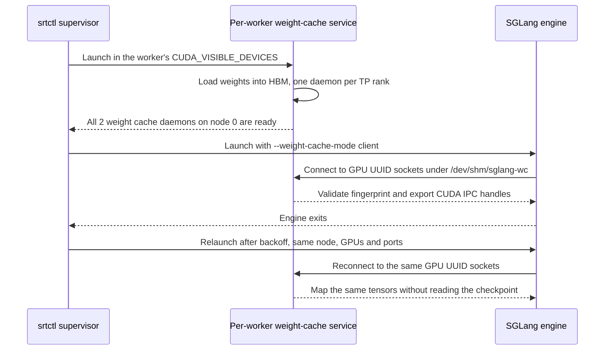

# SGLang Fast Engine Recovery (weight cache daemon)

SGLang's [weight cache daemon](https://www.lmsys.org/blog/2026-08-21-sglang-fast-recovery/) is a persistent GPU process that loads the model once, keeps the post-quantized, TP-sharded tensors in HBM, and hands CUDA IPC handles to any engine on the same GPU. An engine started with `--weight-cache-mode client` maps those tensors instead of reading the checkpoint. The rest of engine startup (CUDA graphs, kernel JIT, tokenizer) still runs. The flags and limitations below follow [SGLang v0.5.20's implementation](https://github.com/sgl-project/sglang/tree/94602c9c2b7cbdb8efd5c52802dac6a1c180089e/python/sglang/srt/weight_cache).

srtctl needs no code for this. The daemon is a [service](services.md) with `placement.per: worker`, the engine flag is an ordinary `roles.<role>.args` entry, and [`roles.<role>.restart`](topology.md#restart) is what relaunches a dead engine so the fast load pays off. The [complete example recipe](https://github.com/NVIDIA/srt-slurm/blob/main/examples/features/sglang-weight-cache.yaml) is the runnable version.

What this gives you is a fast **restart**. It is not a standby: SGLang has no election, so the blog's "active-standby" scenario is a deployment pattern, not a feature. For takeover by a parked standby engine, see [shadow engine recovery](shadow-engine-recovery.md) for vLLM through Dynamo's GPU Memory Service.

## Table of Contents

- [Quick Start](#quick-start)
- [What Runs](#what-runs)
- [What srtctl Owns vs What You Set](#what-srtctl-owns-vs-what-you-set)
- [Testing a Relaunch](#testing-a-relaunch)
- [Limitations](#limitations)
- [Troubleshooting](#troubleshooting)

---

## Quick Start

This is an excerpt of the weight-cache settings, not a complete recipe. Start from the [complete example recipe](https://github.com/NVIDIA/srt-slurm/blob/main/examples/features/sglang-weight-cache.yaml), which includes the required name, model path, precision, and resources, and resolve its model and container aliases in your [cluster config](cluster-config.md). Each worker in this recipe fits on one node.

```yaml
schema: 2
model:
  container: lmsysorg/sglang:v0.5.20        # v0.5.19 or newer
frontend:
  type: sglang-router
engine: sglang
roles:
  agg:
    nodes: 1
    workers: 2
    gpus: 2
    restart: {policy: always, backoff_seconds: 5}
    env:
      SGLANG_WEIGHT_CACHE_SOCKET_TEMPLATE: "/dev/shm/sglang-wc/{device_uuid}.sock"
      SGLANG_WEIGHT_CACHE_READY_TEMPLATE: "/dev/shm/sglang-wc/{device_uuid}.ready"
    args:
      tensor-parallel-size: 2
      weight-cache-mode: client
services:
  - name: weight-cache
    type: generic
    start: before_workers
    critical: true
    placement: {node: agg, per: worker}
    env:
      SGLANG_WEIGHT_CACHE_SOCKET_TEMPLATE: "/dev/shm/sglang-wc/{device_uuid}.sock"
      SGLANG_WEIGHT_CACHE_READY_TEMPLATE: "/dev/shm/sglang-wc/{device_uuid}.ready"
    preamble: "mkdir -p /dev/shm/sglang-wc"
    command: ["python3", "-m", "sglang.srt.weight_cache.daemon", "--model-path", "/model", "--tensor-parallel-size", "2"]
    readiness:
      log: {pattern: "All 2 weight cache daemons on node 0 are ready"}
      timeout_seconds: 900
```

`srtctl dry-run -f <recipe>` lists the service with its placement, probe and environment before you submit.

## What Runs

For each single-node TP2 worker in the example:



- **The service.** `placement.per: worker` gives one instance per worker on each of its nodes, pinned to that worker's device mask, so the daemon's device k and the engine's device k are the same GPU and derive the same UUID. `start: before_workers` puts it up before the engines and, at cleanup, stops it after them (shutdown tier 1). It is `critical` because an engine's liveness watchdog SIGKILLs the engine when its daemon PID disappears (the mapped pointers would dangle).
- **The paths.** Both sides read `SGLANG_WEIGHT_CACHE_SOCKET_TEMPLATE` and `SGLANG_WEIGHT_CACHE_READY_TEMPLATE`; the template must contain `{device_uuid}`, which srtctl's placeholder rendering leaves alone. SGLang's default is `/tmp`, a per-container tmpfs under enroot that the engine step cannot see. `/dev/shm` is the host's, bind-mounted into every container on the node. One node-wide directory is enough because the files are keyed by physical GPU UUID; the daemon removes its files on SIGTERM and cleans up stale ones (dead PID) when it starts.
- **The engine.** `--weight-cache-mode client` connects to the daemon for its GPU, validates a fingerprint (model path and architecture, TP/PP/DP/EP ranks, quantization method and config hash, dtype, compute capability, torch version), and maps every tensor zero-copy. An absent socket falls back to a disk load; a refused connection or a fingerprint mismatch raises.
- **The relaunch.** With `restart: always` or `on-failure`, the supervisor relaunches an exited engine step in place (same node, GPUs and ports, `_r<n>` step name, crash log rotated aside) after the backoff. The relaunched engine maps the daemon's tensors again. `worker_restarts.json` and the lockfile record each event.

## What srtctl Owns vs What You Set

| Piece | Owner | Value |
| --- | --- | --- |
| one daemon group per worker, in its device mask | srtctl | `placement: {node: <role>, per: worker}` |
| start order and shutdown order | srtctl | `start: before_workers` (tier 1, stopped after the engines) |
| readiness gate | you | `readiness.log.pattern` with the rank count the daemon prints (`All <tp> weight cache daemons on node <rank> are ready`) |
| the daemon's argv | you | the engine's model, parallelism, dtype and quantization flags, exactly; a mismatch is refused at engine start, not at load |
| socket and ready paths | you | the two templates, identical on the service and in `roles.<role>.env`, under `/dev/shm` |
| relaunch | you | `roles.<role>.restart`; without it an exited engine's step just ends and `critical` decides |
| the image | you | SGLang v0.5.19 or newer (env-configurable paths, GPU-UUID keyed sockets, static DP/EP layouts) |

## Testing a Relaunch

Kill the engine process, not its step. Use your job ID and the worker's node and allocated HTTP port from the sweep log's `Command:` line. From the login node:

```bash
srun --jobid <job> --overlap -w <node> -N1 bash -c 'pkill -9 -f "sglang.launch_server.*--port <worker-port>( |$)"'
```

Then watch:

- the sweep log: `Worker agg_0_<node> exited with code 137; relaunching agg_0 in 5s (restart 1/3)`, then `Relaunched agg_0 as agg_0_<node>_r1`;
- the new engine log (`<node>_agg_w0.out`; the crash log moved to `<node>_agg_w0.out.1`): `[IpcModelLoader] Loaded model via IPC (mode=client)` and `Load weight end. elapsed=0.0x s`, then `The server is fired up and ready to roll!`;
- the router's `/workers` on the head node: the worker's URL is unchanged, so it is back in rotation as soon as it answers.

The daemon service's log shows nothing during a relaunch; the tensors stay mapped in the daemon regardless of how many engines come and go.

## Limitations

- Fast restart only. No standby engine and no cutover; see [shadow engine recovery](shadow-engine-recovery.md) for that on vLLM.
- Restarts have a finite per-worker budget. Once it is exhausted, the role's `critical` setting decides whether the run fails; see [restart behavior](topology.md#restart) and the generated [RestartPolicy reference](schema-reference.md#restartpolicy) for configuration fields and defaults.
- SGLang v0.5.19 or newer. Older builds hard-code `/tmp/sglang_weight_cache_rank*` paths, which a separate srun step cannot reach.
- IPC-safe quantizations only: unquantized and block-wise FP8 as of v0.5.20. Per-tensor FP8, Marlin, AWQ/GPTQ and NVFP4 raise at daemon start.
- Not with speculative decoding (`--speculative-algorithm`); the daemon does not export the draft model.
- The daemon's argv is written by hand. It must carry the same model, parallelism, dtype and quantization flags as the engine; srtctl does not derive one from the other.
- Workers spanning multiple nodes are not supported by this readiness-gated recipe. srtctl launches each per-worker service instance and waits for its readiness before launching the next. The daemon's distributed rendezvous needs all nodes to start before any node reports ready, so the first node times out while the other nodes are still unlaunched. Adding `--nnodes`, `--node-rank`, and `--dist-init-method` alone does not fix this. Multiple independent single-node workers are supported.
- Per-worker service instances start one after another, each gated on its readiness probe, so a node with N workers pays N daemon start-ups in sequence.
- The daemon is not relaunched. If it dies, its engines SIGKILL themselves (dangling mappings) and, with a restart policy, come back through a disk load or fail on a refused socket; `critical: true` on the service fails the run instead.

## Troubleshooting

| Symptom | Cause | Fix |
| --- | --- | --- |
| engine log: `Daemon socket not found at /tmp/sglang_weight_cache_...` and a normal disk load | the templates are not set on the engine, or point at a per-container path | set both templates in `roles.<role>.env` under `/dev/shm` |
| service log: `sglang serve: error: unrecognized arguments` | the daemon parses the full engine argument set; a flag the image no longer knows | drop the flag; the same flag would break the engine too |
| engine log: `Daemon config mismatch` | the daemon's argv differs from the engine's (model, TP, dtype, quantization) | mirror the engine's flags in `services[].command` |
| engine dies with `Weight cache daemon (pid=...) died while this engine holds its weights` | the service was stopped or crashed | keep `start: before_workers` (stopped after the engines) and `critical: true`; check the service log |
| readiness probe times out while the daemons say `Listening on ...` | the pattern's rank or node count does not match the launcher's summary line | use the printed `All <n> weight cache daemons on node <k> are ready` text |
| `already running (pid=...)` at daemon start | a live daemon already owns that GPU's socket | confirm which job owns the daemon before stopping it; remove a leaked daemon only after verifying its job has ended |
